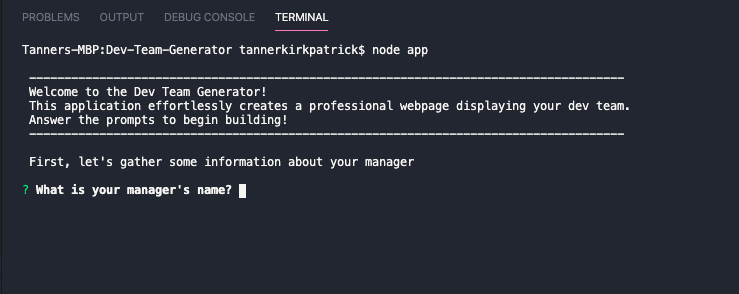
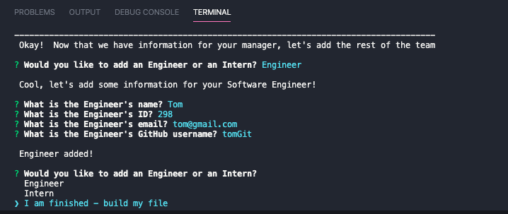
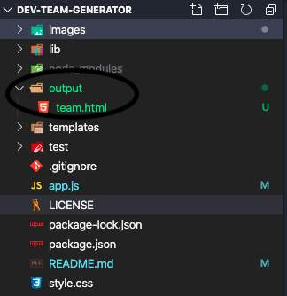
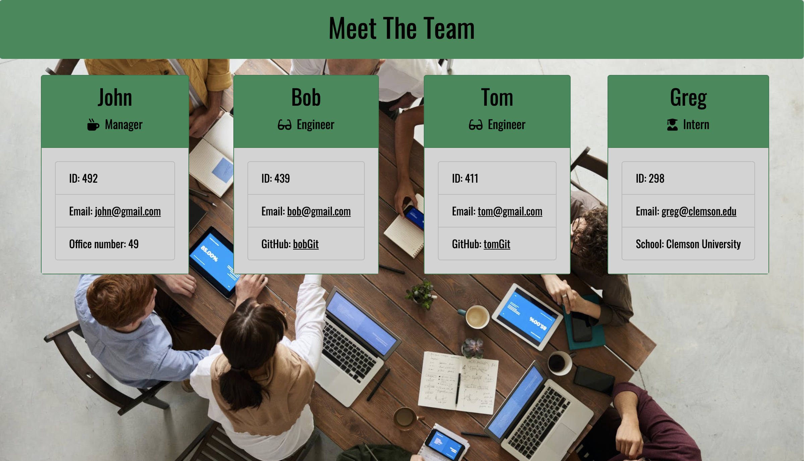
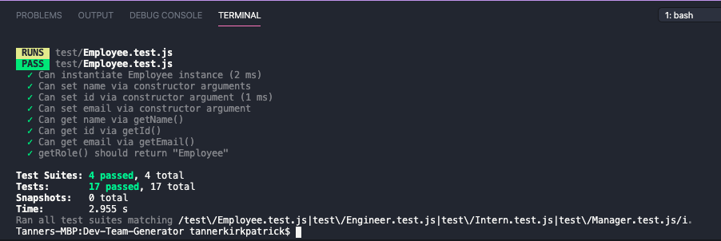

# Dev Team Generator
This is a node CLI application that builds a professional HTML webpage displaying summaries for the members of your development team.  You are able to add as many team members as you'd like (one manager and any mix of engineers and interns).  Simply answer the provided prompts with information about your team, and you will have a polished, formatted team profile page for your dev team!

<a href="https://drive.google.com/file/d/1rnyDBA3I1TiyPAV86bFAXXXSBBDdvuuP/view?usp=sharing">View Demo Video Here</a>


## Table of Contents
* [Installation](#installation)
* [Usage](#usage)
* [Sample Team Profile](#sample-team-profile)
* [Contributions](#contributions)
* [Testing](#testing)
* [Questions](#questions)
* [License](#license)


## Installation
1. Clone repo.
2. Open local folder.
3. Inside of root directory, Run command ```npm i``` to install all required dependencies.

## Usage
1. Within the working directory, run command ```node app``` to begin.
2. Answer the prompts and add as many team members as you'd like.
3. Once you've entered all of the necessary information, select ```I am finished - build my file``` to generate your HTML.
4. Your generated HTML file labeled ```team.html```  will be in the ```output``` directory.
 <br>




## Sample Team Profile


## Contributions
Contributions to this application are more than welcome!  Clone the repo down to your local machine, commit changes, push up to Github, and open a pull request!

## Testing
There are a number of tests written to check the accuracy of this application via Jest.  Run command ```npm run test``` to test all suites.



## Questions
If you have any further questions, feel free to reach out to me! <br>
Github: <a href='https://www.github.com/twkirkpatrick'>twkirkpatrick</a> <br>
Email: <a href='mailto:twk4491@gmail.com'>twk4491@gmail.com</a>

## License
Usage is provided under the MIT license.  Refer to the LICENSE.txt file for more information.
